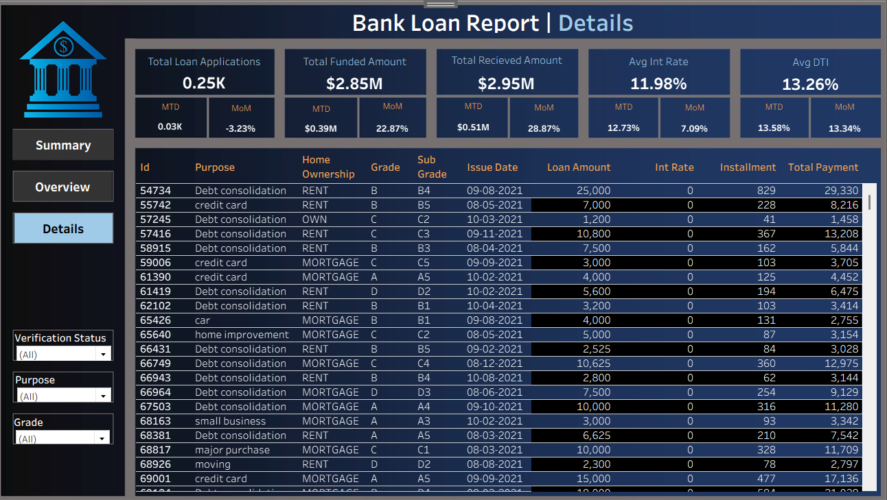
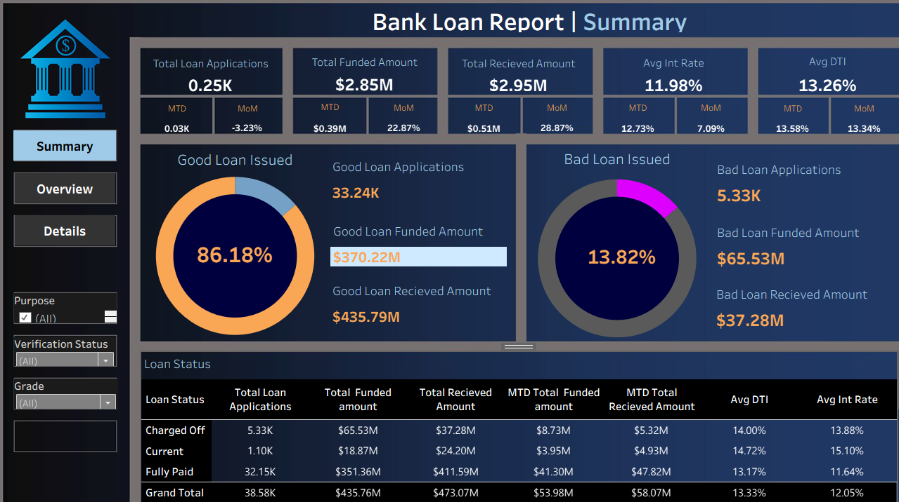

# Bank Loan Analysis Dashboard

## 📊 Project Overview

This project analyzes bank loan data using **PostgreSQL** for data querying and **Tableau** for visualization.
The goal is to understand loan performance, funding trends, and repayment behavior through interactive dashboards.

The dataset contains loan applications with information such as loan amount, issue date, total payment, and other loan-related attributes. Using SQL queries in **pgAdmin (PostgreSQL)**, the data is aggregated and prepared for visualization in Tableau.

---

## 🎯 Objectives

* Analyze **loan application trends over time**
* Measure **total funded amounts**
* Track **loan repayments**
* Identify **monthly patterns in loan issuance**
* Create an **interactive Tableau dashboard** for business insights

---

## 🛠️ Tools & Technologies

* **PostgreSQL** – Database management and data querying
* **pgAdmin** – PostgreSQL administration and query execution
* **SQL** – Data aggregation and analysis
* **Tableau** – Data visualization and dashboard creation

---

## 🗂️ Project Workflow

### 1. Data Import

* Import the loan dataset into **PostgreSQL** using pgAdmin.
* Create a database and table to store the dataset.

### 2. Data Exploration

Use SQL queries to understand:

* Total loan applications
* Funded loan amounts
* Total payments received
* Monthly loan distribution

### 3. Data Visualization

* Connect **Tableau to PostgreSQL**
* Create dashboards showing:

  * Monthly loan trends
  * Total funded amount
  * Total repayment amount
  * Loan application count

---

## 📈 Dashboard Insights

The Tableau dashboard provides insights such as:

* Monthly trends in loan applications
* Total loan funding distribution
* Comparison between funded amount and repayments
* Key performance indicators (KPIs)

---

## 🚀 How to Run the Project

1. Install **PostgreSQL** and **pgAdmin**
2. Create a new database
3. Import the dataset into a table
4. Run the SQL queries for analysis
5. Connect **Tableau to PostgreSQL**
6. Build visualizations using the query results

---

## 📊 Key Metrics

* Total Loan Applications
* Total Funded Amount
* Total Amount Received
* Monthly Loan Trends
* Add loan status analysis (good vs bad loans)v
---

## 📌 Future Improvements

* Build predictive models for loan default risk
* Automate ETL pipeline
* Deploy dashboard to Tableau Server or Tableau Public

---

## 📊 Tableau Dashboard

.png)

## 👤 Author

Vaishnavi singh

---

## 📄 License

This project is for educational and
